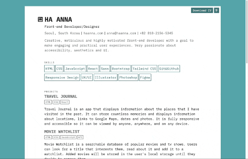

# CV App [10 June 2022]

This is a solo project that I decided to complete so that I can show off my CV in three languages (English, Korean, Polish) and make it easily downloadable and shareable.

## Table of contents

- [Overview](#overview)
  - [Screenshot](#screenshot)
  - [Links](#links)
- [My process](#my-process)
  - [Built with](#built-with)
  - [What I learned](#what-i-learned)
  - [Continued development](#continued-development)
  - [Useful resources](#useful-resources)
- [Author](#author)
- [Acknowledgments](#acknowledgments)

## Overview

After learning basics of React, I decided to test my skills by creating this page. I made sure it's responsive and accessible.

### Screenshot

### Links

- Live Site URL: [CV Page](https://ha-anna-cv.vercel.app/)

## My process

I started by creating a template file that will store all of the necessary data that I want to display. Then, I created an HTML structure, added CSS and responsiveness.
After that, I checked accessibility (colors, contrast, alt tags, HTML document structure, headings), and created a CSS for print.

### Built with

- CSS
- React

### What I learned

I became more accustomed with using React and creating data files.

### Continued development

Keeping the information up to date.

### Useful resources

## Author

- Website - [Ha Anna](https://haanna.com)

## Acknowledgments

I'd like to thank people who reviewed my code and gave me their opinions on how certain things can be done better.
